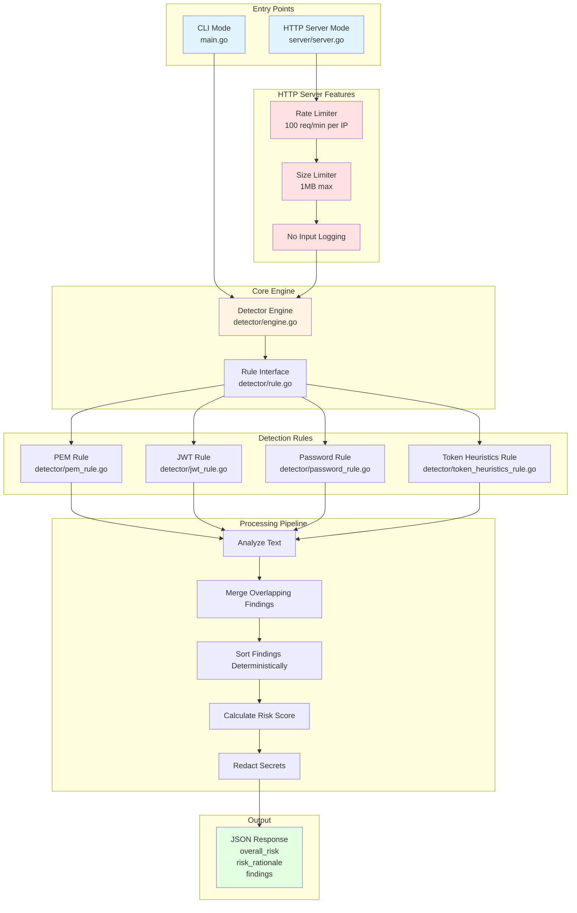

# Pasteguard Architecture

## System Overview

Pasteguard is a secret detection tool that can operate in two modes:
1. **CLI Mode**: Command-line interface for analyzing text from stdin or `--text` flag
2. **HTTP Server Mode**: REST API server for programmatic access

## Architecture Diagram



## Component Details

### Entry Points

#### CLI Mode (`main.go`)
- **Input**: 
  - `--text` flag (handles empty strings)
  - stdin (piped input)
- **Output**: JSON to stdout
- **Exit Code**: Always 0

#### HTTP Server Mode (`server/server.go`)
- **Command**: `pasteguard serve --addr :8787`
- **Endpoints**:
  - `GET /health` - Health check
  - `POST /analyze` - Analyze text
- **Security**:
  - Rate limiting: 100 requests/minute per IP
  - Size limit: 1MB max request body
  - No input logging

### Core Engine (`detector/engine.go`)

**Responsibilities**:
- Coordinates rule execution
- Merges overlapping findings
- Sorts findings deterministically
- Calculates overall risk score
- Redacts sensitive data

**Key Methods**:
- `NewEngine()` - Creates engine with default rules
- `Analyze(text string)` - Main analysis method
- `AddRule(rule Rule)` - Add custom rules
- `MergeOverlappingFindings()` - Merge overlapping detections
- `SortFindings()` - Deterministic sorting

### Detection Rules

All rules implement the `Rule` interface:
```go
type Rule interface {
    Name() string
    Analyze(text string) []Finding
}
```

#### PEM Rule (`detector/pem_rule.go`)
- **Detects**: PEM-encoded private keys (RSA, EC, DSA, generic)
- **Severity**: High
- **Confidence**: High
- **Pattern**: `-----BEGIN ... PRIVATE KEY-----`

#### JWT Rule (`detector/jwt_rule.go`)
- **Detects**: JWT tokens (3-part base64 strings)
- **Severity**: High
- **Confidence**: High
- **Pattern**: `xxx.yyy.zzz` format with base64 parts

#### Password Rule (`detector/password_rule.go`)
- **Detects**: Password assignments (password, api_key, secret, etc.)
- **Severity**: High
- **Confidence**: Medium
- **Pattern**: `password = "value"` or `password: "value"`

#### Token Heuristics Rule (`detector/token_heuristics_rule.go`)
- **Detects**: High-entropy token-like strings
- **Severity**: High or Medium (based on score)
- **Confidence**: High, Medium, or Low
- **Features**:
  - Entropy calculation
  - Length scoring
  - Charset variety
  - Proximity to auth keywords
  - Conservative filtering (ignores UUIDs, hashes, etc.)

### Processing Pipeline

1. **Analyze**: All rules analyze the input text in parallel
2. **Merge**: Findings with overlapping byte ranges are merged
   - Takes highest severity
   - Takes maximum confidence
   - Concatenates reasons
   - Combines byte ranges
3. **Sort**: Findings sorted by:
   - Line number (ascending)
   - Byte start position (ascending)
   - Byte end position (ascending)
4. **Score**: Calculate overall risk:
   - `high` if any finding has `high` severity
   - `medium` if any findings exist
   - `low` if no findings
5. **Redact**: Mask sensitive data in findings:
   - Token heuristics: More aggressive masking (>50%)
   - Other rules: Standard masking (first 4, last 4 chars)

### Data Structures

#### Finding
```go
type Finding struct {
    Type       string `json:"type"`
    Severity   string `json:"severity"`      // "high", "medium", "low"
    Confidence string `json:"confidence"`    // "high", "medium", "low"
    Reason     string `json:"reason"`       // Redacted
    LineNumber int    `json:"line_number"`
    ByteStart  int    `json:"-"`            // Internal (for merging)
    ByteEnd    int    `json:"-"`            // Internal (for merging)
    RawMatch   string `json:"-"`            // Internal (for redaction)
}
```

#### AnalysisResult
```go
type AnalysisResult struct {
    OverallRisk   string
    RiskRationale string
    Findings      []Finding
}
```

### HTTP Server Security

#### Rate Limiter
- **Algorithm**: Token bucket per IP
- **Limit**: 100 requests per minute
- **Window**: 1 minute sliding window
- **Storage**: In-memory map (IP -> timestamps)

#### Size Limiter
- **Limit**: 1MB request body
- **Enforcement**: `http.MaxBytesReader`
- **Error**: HTTP 400 Bad Request

#### No Input Logging
- User input never logged to console
- Error messages don't include user data
- Only generic error messages returned

## Data Flow

### CLI Mode Flow
```
User Input (--text or stdin)
    ↓
main.go (parse args)
    ↓
detector.Engine.Analyze()
    ↓
All Rules Execute (parallel)
    ↓
Merge Overlapping Findings
    ↓
Sort Findings
    ↓
Calculate Risk Score
    ↓
Redact Secrets
    ↓
JSON Output to stdout
```

### HTTP Server Flow
```
HTTP Request (POST /analyze)
    ↓
Rate Limiter Check
    ↓
Size Limit Check (1MB)
    ↓
Parse JSON Body
    ↓
detector.Engine.Analyze()
    ↓
[Same pipeline as CLI]
    ↓
JSON Response (HTTP 200)
```

## Security Considerations

1. **No Input Logging**: User data never appears in logs
2. **Redaction**: All secrets are masked in output
3. **Rate Limiting**: Prevents abuse and DoS
4. **Size Limits**: Prevents memory exhaustion
5. **No RawMatch in JSON**: Internal fields never exposed
6. **Deterministic Output**: Same input = same output (no timing leaks)

## Testing Architecture

```
Tests/
├── main_test.go (CLI tests)
├── detector/
│   ├── engine_test.go
│   ├── pem_rule_test.go
│   ├── jwt_rule_test.go
│   ├── password_rule_test.go
│   ├── token_heuristics_rule_test.go
│   ├── redaction_test.go
│   ├── redaction_token_test.go
│   └── merge_test.go
└── server/
    └── server_test.go
```

**Test Coverage**:
- CLI: 13 tests
- HTTP Server: 15 tests
- Rules: 50+ tests
- Engine: 10+ tests
- Redaction: 8 tests
- Merge/Sort: 11 tests
- **Total: 95+ tests**

## Deployment Considerations

### CLI Mode
- Single binary deployment
- No dependencies (standard library only)
- Stateless operation

### HTTP Server Mode
- Single binary deployment
- No external dependencies
- In-memory rate limiting (resets on restart)
- Suitable for containerization
- Consider reverse proxy for production (TLS, additional rate limiting)

## Future Enhancements

Potential additions:
- Persistent rate limiting (Redis/database)
- Authentication/Authorization
- Webhook notifications
- Custom rule configuration
- Batch processing endpoint
- Metrics/telemetry endpoint

