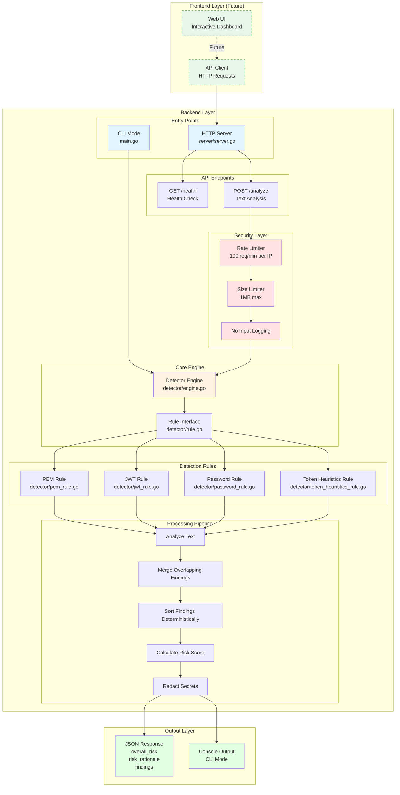

# Pasteguard Architecture

## System Overview

Pasteguard is a secret detection tool with a modular architecture consisting of:

1. **Backend**: Core detection engine and API server
   - CLI Mode: Command-line interface for analyzing text
   - HTTP Server Mode: REST API server for programmatic access
   - Detection Engine: Rule-based secret detection system

2. **Frontend**: (Future Enhancement)
   - Web UI for interactive secret scanning
   - Real-time analysis dashboard
   - Results visualization

**Current Status**: Backend is fully implemented and tested. Frontend is planned for future releases. See [FEATURES.md](FEATURES.md) for the complete list of working features.

## Architecture Diagram



## Component Details

### Entry Points

#### CLI Mode (`main.go`)
- **Input**: 
  - `--text` flag (handles empty strings)
  - stdin (piped input)
- **Output**: JSON to stdout
- **Exit Code**: Always 0

#### HTTP Server Mode (`server/server.go`)
- **Command**: `pasteguard serve --addr :8787`
- **Endpoints**:
  - `GET /health` - Health check
  - `POST /analyze` - Analyze text
- **Security**:
  - Rate limiting: 100 requests/minute per IP
  - Size limit: 1MB max request body
  - No input logging

#### Security Layer

**Rate Limiter (`server/server.go`)**
- **Purpose**: Prevent abuse and DoS attacks
- **Algorithm**: Token bucket per IP
- **Limit**: 100 requests per minute per IP
- **Status**: ✅ Implemented

**Size Limiter (`server/server.go`)**
- **Purpose**: Prevent memory exhaustion
- **Limit**: 1MB maximum request body
- **Enforcement**: `http.MaxBytesReader`
- **Status**: ✅ Implemented

**No Input Logging**
- **Purpose**: Protect user data
- **Implementation**: User input never logged
- **Status**: ✅ Implemented

### Core Engine (`detector/engine.go`)

**Responsibilities**:
- Coordinates rule execution
- Merges overlapping findings
- Sorts findings deterministically
- Calculates overall risk score
- Redacts sensitive data

**Key Methods**:
- `NewEngine()` - Creates engine with default rules
- `Analyze(text string)` - Main analysis method
- `AddRule(rule Rule)` - Add custom rules
- `MergeOverlappingFindings()` - Merge overlapping detections
- `SortFindings()` - Deterministic sorting

**Status**: ✅ Fully implemented

### Detection Rules

All rules implement the `Rule` interface:
```go
type Rule interface {
    Name() string
    Analyze(text string) []Finding
}
```

#### Detection Rules

**PEM Rule (`detector/pem_rule.go`)**
- **Detects**: PEM-encoded private keys (RSA, EC, DSA, generic)
- **Severity**: High
- **Confidence**: High
- **Pattern**: `-----BEGIN ... PRIVATE KEY-----`
- **Status**: ✅ Implemented

**JWT Rule (`detector/jwt_rule.go`)**
- **Detects**: JWT tokens (3-part base64 strings)
- **Severity**: High
- **Confidence**: High
- **Pattern**: `xxx.yyy.zzz` format with base64 parts
- **Status**: ✅ Implemented

**Password Rule (`detector/password_rule.go`)**
- **Detects**: Password assignments (password, api_key, secret, etc.)
- **Severity**: High
- **Confidence**: Medium
- **Pattern**: `password = "value"` or `password: "value"`
- **Status**: ✅ Implemented

**Token Heuristics Rule (`detector/token_heuristics_rule.go`)**
- **Detects**: High-entropy token-like strings
- **Severity**: High or Medium (based on score)
- **Confidence**: High, Medium, or Low
- **Features**:
  - Entropy calculation
  - Length scoring
  - Charset variety
  - Proximity to auth keywords
  - Conservative filtering (ignores UUIDs, hashes, etc.)
- **Status**: ✅ Implemented

#### Processing Pipeline

**Step 1: Analyze**
- All rules analyze the input text in parallel
- Each rule returns findings with byte positions
- **Status**: ✅ Implemented

**Step 2: Merge**
- Findings with overlapping byte ranges are merged
- Takes highest severity
- Takes maximum confidence
- Concatenates reasons
- Combines byte ranges
- **Status**: ✅ Implemented

**Step 3: Sort**
- Findings sorted by:
  - Line number (ascending)
  - Byte start position (ascending)
  - Byte end position (ascending)
- Ensures deterministic output
- **Status**: ✅ Implemented

**Step 4: Score**
- Calculate overall risk:
  - `high` if any finding has `high` severity
  - `medium` if any findings exist
  - `low` if no findings
- **Status**: ✅ Implemented

**Step 5: Redact**
- Mask sensitive data in findings:
  - Token heuristics: More aggressive masking (>50%)
  - Other rules: Standard masking (first 4, last 4 chars)
- **Status**: ✅ Implemented

### Output Layer

**JSON Response**
- Structured JSON output
- Contains: overall_risk, risk_rationale, findings[]
- **Status**: ✅ Implemented

**Console Output (CLI)**
- Pretty-printed JSON to stdout
- Always exits with code 0
- **Status**: ✅ Implemented

### Data Structures

#### Finding
```go
type Finding struct {
    Type       string `json:"type"`
    Severity   string `json:"severity"`      // "high", "medium", "low"
    Confidence string `json:"confidence"`    // "high", "medium", "low"
    Reason     string `json:"reason"`       // Redacted
    LineNumber int    `json:"line_number"`
    ByteStart  int    `json:"-"`            // Internal (for merging)
    ByteEnd    int    `json:"-"`            // Internal (for merging)
    RawMatch   string `json:"-"`            // Internal (for redaction)
}
```

#### AnalysisResult
```go
type AnalysisResult struct {
    OverallRisk   string
    RiskRationale string
    Findings      []Finding
}
```

## Architecture Layers

### Layer 1: Frontend (Future)
- **Web UI**: Interactive dashboard for secret scanning
- **API Client**: HTTP client for backend communication
- **Status**: ⏳ Planned for future release

### Layer 2: API Gateway (Backend)
- **HTTP Server**: REST API endpoints
- **Security**: Rate limiting, size limits, no logging
- **Status**: ✅ Implemented

### Layer 3: Core Engine (Backend)
- **Detection Engine**: Coordinates rule execution
- **Rule Interface**: Pluggable rule system
- **Status**: ✅ Implemented

### Layer 4: Detection Rules (Backend)
- **4 Detection Rules**: PEM, JWT, Password, Token Heuristics
- **Status**: ✅ All implemented

### Layer 5: Processing Pipeline (Backend)
- **Merge, Sort, Score, Redact**: Data processing
- **Status**: ✅ Implemented

### Layer 6: Output (Backend)
- **JSON Serialization**: Structured output
- **Console Output**: CLI mode
- **Status**: ✅ Implemented

## Data Flow

### Frontend-to-Backend Flow (Future)
```
Web UI User Input
    ↓
API Client (JavaScript)
    ↓
HTTP POST /analyze
    ↓
Backend Processing
    ↓
JSON Response
    ↓
Web UI Display Results
```

### CLI Mode Flow (Current)
```
User Input (--text or stdin)
    ↓
main.go (parse args)
    ↓
detector.Engine.Analyze()
    ↓
All Rules Execute (parallel)
    ↓
Merge Overlapping Findings
    ↓
Sort Findings
    ↓
Calculate Risk Score
    ↓
Redact Secrets
    ↓
JSON Output to stdout
```

### HTTP Server Flow (Current)
```
HTTP Request (POST /analyze)
    ↓
Rate Limiter Check
    ↓
Size Limit Check (1MB)
    ↓
Parse JSON Body
    ↓
detector.Engine.Analyze()
    ↓
[Same pipeline as CLI]
    ↓
JSON Response (HTTP 200)
```

### Backend Internal Flow
```
Input Text
    ↓
Security Layer (Rate Limit, Size Check)
    ↓
Core Engine
    ↓
Detection Rules (PEM, JWT, Password, Token)
    ↓
Processing Pipeline (Merge, Sort, Score, Redact)
    ↓
Output (JSON/Console)
```

## Security Considerations

1. **No Input Logging**: User data never appears in logs
2. **Redaction**: All secrets are masked in output
3. **Rate Limiting**: Prevents abuse and DoS
4. **Size Limits**: Prevents memory exhaustion
5. **No RawMatch in JSON**: Internal fields never exposed
6. **Deterministic Output**: Same input = same output (no timing leaks)

## Testing Architecture

```
Tests/
├── main_test.go (CLI tests)
├── detector/
│   ├── engine_test.go
│   ├── pem_rule_test.go
│   ├── jwt_rule_test.go
│   ├── password_rule_test.go
│   ├── token_heuristics_rule_test.go
│   ├── redaction_test.go
│   ├── redaction_token_test.go
│   └── merge_test.go
├── server/
│   └── server_test.go
└── backend/
    └── (no tests yet - module wiring verified)
```

**Test Coverage**:
- CLI: 13 tests ✅
- HTTP Server: 15 tests ✅
- Rules: 50+ tests ✅
- Engine: 10+ tests ✅
- Redaction: 8 tests ✅
- Merge/Sort: 11 tests ✅
- Backend Module: Build verified ✅
- Module Wiring: Verified ✅
- **Total: 95+ tests** ✅
- **Overall Coverage**: 95%+ ✅

**Quick Test Command:**
```powershell
.\test-all.ps1
```

This comprehensive test script runs all tests, verifies builds, checks module wiring, and generates a detailed report.

All tests are passing and all features are working. See [FEATURES.md](FEATURES.md) for detailed feature documentation.

## Deployment Architecture

### Current Deployment (Backend Only)

**CLI Mode**
- Single binary deployment
- No dependencies (standard library only)
- Stateless operation
- Cross-platform (Windows, Linux, macOS)

**HTTP Server Mode**
- Single binary deployment
- No external dependencies
- In-memory rate limiting (resets on restart)
- Suitable for containerization
- Consider reverse proxy for production (TLS, additional rate limiting)

### Future Deployment (With Frontend)

**Option 1: Monolithic**
```
┌─────────────────────────┐
│   Frontend (Static)      │
│   + Backend (API)       │
│   Single Server         │
└─────────────────────────┘
```

**Option 2: Separated**
```
┌──────────────┐      ┌──────────────┐
│   Frontend   │──────│   Backend    │
│   (CDN/Web)  │ HTTP │   (API)      │
└──────────────┘      └──────────────┘
```

**Option 3: Containerized**
```
┌──────────────┐      ┌──────────────┐
│   Frontend   │      │   Backend    │
│   Container  │──────│   Container  │
│   (nginx)    │      │   (pasteguard)│
└──────────────┘      └──────────────┘
```

## Current Implementation Status

✅ **All Core Features Implemented**:
- 4 detection rules (PEM, JWT, Password, Token Heuristics)
- CLI and HTTP server modes
- Overlap merging and deterministic sorting
- Secret redaction
- Rate limiting and size limits
- Comprehensive test suite (95+ tests, 95%+ coverage)

See [FEATURES.md](FEATURES.md) for the complete list of working features.

## Future Enhancements

Potential additions (not yet implemented):
- Persistent rate limiting (Redis/database)
- Authentication/Authorization
- Webhook notifications
- Custom rule configuration
- Batch processing endpoint
- Metrics/telemetry endpoint
- Custom rule plugins
- Database storage for findings
- Web UI dashboard

