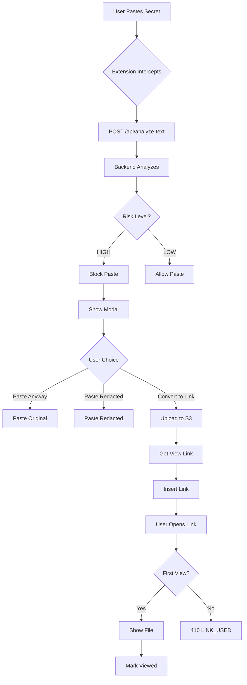

# Repo map

## Tech stack with evidence

**Backend (Go):**
- **Language**: Go 1.23+ (`go.mod` line 3)
- **Core detection engine**: `pasteguard/detector` module (`go.mod` line 12, `detector/engine.go`)
- **HTTP server**: Standard library `net/http` (`server/server.go` lines 10, 576-593)
- **AWS SDK**: `github.com/aws/aws-sdk-go-v2` for S3 uploads (`go.mod` lines 8-10, `backend/main.go` lines 17-19)
- **Dependencies**: Standard library only for detector, AWS SDK for backend uploads

**Browser Extension (JavaScript):**
- **Manifest**: Manifest V3 (`extension/manifest.json` line 2)
- **Content Script**: `extension/content.js` (paste interception, link scanning, secure upload injection)
- **Background Service Worker**: `extension/background.js` (API calls, caching)
- **Popup UI**: `extension/popup.html` and `extension/popup.js`

**E2E Testing:**
- **Framework**: Playwright (`e2e/package.json`)
- **Test runner**: Node.js (`e2e/package.json`)

## Main entrypoints and runtime flow

**CLI Mode Entry Point:**
- `main.go` lines 20-29: Checks for `serve` command, otherwise runs CLI mode
- `main.go` lines 45-142: CLI mode parses `--text` flag or reads from stdin, calls `detector.NewEngine().Analyze()`

**HTTP Server Entry Point:**
- `main.go` lines 31-43: `runServer()` function starts HTTP server on port 8080 (default) or custom port
- `server/server.go` lines 576-593: `Start()` method creates HTTP server with routes registered via `RegisterRoutes()`
- `server/server.go` lines 567-574: Routes registered: `/health`, `/analyze`, `/api/analyze-text`, `/api/upload`, `/api/generate-upload-url`, `/view/<id>`

**Browser Extension Entry Points:**
- `extension/manifest.json` lines 16-17: Background service worker (`background.js`)
- `extension/manifest.json` lines 22-33: Content script (`content.js`) injected on all URLs
- `extension/manifest.json` lines 19-21: Popup UI (`popup.html`) accessible via extension icon
- `extension/dashboard.html`: Dashboard UI with Home, Metrics, and Activity pages

**Backend Server (Separate Module):**
- `backend/main.go` lines 98-435: Main function starts server on port 8080
- `backend/main.go` lines 120-193: `/api/upload` endpoint (proxy upload to S3)
- `backend/main.go` lines 310-370: `/api/analyze-text` endpoint (text analysis)
- `backend/main.go` lines 266-308: `/view/<id>` endpoint (one-time view links)

## Key folders

- **`detector/`**: Core secret detection engine (`engine.go`, rule implementations: `pem_rule.go`, `jwt_rule.go`, `password_rule.go`, `token_heuristics_rule.go`)
- **`server/`**: HTTP server implementation (`server.go` with rate limiting, CORS, security)
- **`backend/`**: Separate backend module for file uploads and one-time links (`main.go`)
- **`extension/`**: Browser extension (`content.js`, `background.js`, `popup.html`, `dashboard.html`, `manifest.json`)
- **`e2e/`**: End-to-end tests (`tests/*.spec.js`, `testapp/` for test pages)

## Config and required env vars

**Backend Server (for file uploads):**
- `AWS_BUCKET_NAME`: S3 bucket name (optional, defaults to "guardrail-demo-bucket" if not set) (`backend/main.go` lines 99-104)
- `VIEW_LINK_BASE_URL`: Base URL for view links (optional, defaults to "http://localhost:8080") (`backend/main.go` lines 105-108)
- `.env` file support: `backend/main.go` lines 40-64 loads `.env` from current directory
- **Evidence**: `BACKEND_SETUP.md` lines 7-25 documents `.env` file setup

**Pasteguard Server (for text analysis):**
- No required env vars for basic operation
- Optional: `AWS_BUCKET_NAME` if using file upload features
- **Evidence**: `server/server.go` lines 114-129 shows optional env var loading

**Extension:**
- No env vars required
- Hardcoded API endpoint: `http://localhost:8080` (`extension/content.js` line 205, `extension/background.js` line 1-2)
- **Evidence**: `extension/manifest.json` line 14 allows `http://localhost:8080/*`

# How to run locally

## Minimal setup steps

**1. Install Go 1.21+** (if not installed)
- Verify: `go version`

**2. Start the unified server:**
```powershell
# From project root
go run . serve
```
- **Evidence**: `STARTUP_AND_TESTING.md` lines 30-32
- Server starts on `http://localhost:8080` by default
- **Expected output**: `Starting pasteguard server on :8080` (`server/server.go` line 592)

**3. Load browser extension:**
- Open `chrome://extensions/` or `edge://extensions/`
- Enable Developer mode (toggle top-right)
- Click "Load unpacked"
- Select `extension` folder
- **Evidence**: `EXTENSION_SETUP.md` lines 9-13

**4. Verify extension is active:**
- Open any webpage, press F12 → Console
- Look for: `Privacy Guardrail: Initializing...`
- **Evidence**: `EXTENSION_SETUP.md` lines 54-77

## One command path if available

**PowerShell (from project root):**
```powershell
# Start server (keep terminal open)
go run . serve
```

**Note**: Extension must be loaded manually via browser (no CLI command available).

## Sanity check

**1. Test server health:**
```powershell
Invoke-RestMethod -Uri http://localhost:8080/health
```
- **Expected**: `{"ok": true}` or `{"status": "ok"}`
- **Evidence**: `server/server.go` lines 306-313, `backend/main.go` (no explicit health endpoint, but server responds)

**2. Test paste interception:**
- Open any webpage with an input field
- Copy: `password = "secret123"`
- Paste into input field
- **Expected**: Paste blocked, modal appears
- **Evidence**: `extension/content.js` lines 1017-1038 (paste event listener), `STARTUP_AND_TESTING.md` lines 132-154

**3. Check extension console:**
- Press F12 → Console tab
- **Expected**: `Privacy Guardrail: Initializing...` and `Privacy Guardrail: Active and observing mutations.`
- **Evidence**: `extension/content.js` lines 1158-1175

# Top end user features

## 1. Real-time paste interception (PRIMARY "MOMENT OF WOW")

**User value**: Prevents accidental exposure of secrets (passwords, API keys, tokens) by blocking pastes containing sensitive data in real-time.

**Persona**: Developer, security-conscious user, anyone handling sensitive credentials.

**Code location evidence**:
- **Paste event interception**: `extension/content.js` lines 1017-1038 (`document.addEventListener('paste', ...)`)
- **Text analysis**: `extension/background.js` lines 122-212 (`ANALYZE_TEXT` message handler calls `http://localhost:8080/api/analyze-text`)
- **Blocking modal**: `extension/content.js` lines 554-911 (`showPasteBlockModal()` function)
- **Backend analysis**: `backend/main.go` lines 310-370 (`/api/analyze-text` endpoint calls `detectorEngine.Analyze()`)
- **Detection rules**: `detector/password_rule.go`, `detector/jwt_rule.go`, `detector/pem_rule.go`, `detector/token_heuristics_rule.go`

**Why it's the "moment of wow"**: Instant visual feedback - user pastes secret, paste is blocked immediately, modal appears showing risk level and findings. Happens in under 1 second.

## 2. Secure file upload with one-time view links

**User value**: Upload files securely to S3 and share via one-time view-only links (recipient can view once, then link expires).

**Persona**: User sharing sensitive documents, developer sharing credentials securely.

**Code location evidence**:
- **Secure Share button injection**: `extension/content.js` lines 208-234 (`injectSecureUpload()` function adds button next to file inputs)
- **Upload modal**: `extension/content.js` lines 236-313 (`openSecureUploadModal()` function)
- **File upload**: `extension/background.js` lines 35-63 (`upload` message handler posts to `/api/upload`)
- **Backend upload**: `backend/main.go` lines 120-193 (`/api/upload` endpoint uploads to S3)
- **One-time view link**: `backend/main.go` lines 266-308 (`/view/<id>` endpoint marks as viewed, returns 410 on second access)
- **Popup upload**: `extension/popup.html` lines 401-429 (Secure Upload section in popup)

## 3. Link scanning and malicious domain blocking

**User value**: Automatically flags malicious links on webpages and blocks access to known malicious domains.

**Persona**: General web user, security-conscious browser.

**Code location evidence**:
- **Link validation**: `extension/content.js` lines 140-165 (`validateLink()` function checks against blocklist)
- **Malicious domain list**: `extension/malicious_domains.json` (loaded in `content.js` lines 6-27)
- **Warning icons**: `extension/content.js` lines 167-193 (`flagLink()` function adds ⚠️ icon)
- **Domain blocking overlay**: `extension/content.js` lines 76-118 (`showBlockingPopup()` function shows red overlay)
- **Current page check**: `extension/content.js` lines 54-74 (`checkCurrentPage()` function)
- **Link checker in popup**: `extension/popup.js` lines 152-190 (`checkLink()` function)

## 4. Convert blocked paste to secure share link

**User value**: When paste is blocked, user can convert the sensitive text to a secure one-time view link instead of pasting directly.

**Persona**: Developer who needs to share secrets securely.

**Code location evidence**:
- **Convert button in modal**: `extension/content.js` lines 734-898 (convert button handler uploads text as file)
- **Text upload**: `extension/background.js` lines 65-98 (`UPLOAD_SECURE_TEXT` message handler)
- **Link insertion**: `extension/content.js` lines 887-896 (inserts view link into input field)
- **Settings toggle**: `extension/popup.html` lines 381-390 (toggle to enable/disable convert feature)

## 5. Session statistics and settings

**User value**: Track how many pastes were analyzed/blocked and configure paste guard behavior.

**Persona**: Power user, security administrator.

**Code location evidence**:
- **Stats display**: `extension/popup.html` lines 338-354 (session stats: analyzed, blocked, links created)
- **Stats tracking**: `extension/background.js` lines 10-14 (stats object), lines 100-103 (`PASTE_BLOCKED` increments counter)
- **Settings UI**: `extension/popup.html` lines 356-391 (paste guard enabled toggle, block threshold, convert link toggle)
- **Settings persistence**: `extension/popup.js` lines 199-234 (loads/saves settings from `chrome.storage.sync`)

# Outcomes

## Demonstrable outcomes

**1. Secrets are blocked from being pasted:**
- **Evidence**: `extension/content.js` lines 1017-1038 (paste event prevented), lines 554-911 (blocking modal shown)
- **Outcome**: User cannot accidentally paste secrets into web forms
- **Measurable**: Modal appears, paste is blocked, user must choose action (paste anyway, paste redacted, convert to link)

**2. One-time view links expire after first use:**
- **Evidence**: `backend/main.go` lines 283-290 (marks `meta.Viewed = true`), lines 511-521 (returns 410 if already viewed)
- **Outcome**: Shared links can only be opened once, preventing unauthorized access
- **Measurable**: First view returns file, second view returns 410 "LINK_USED" or "This link has expired or already been viewed"

**3. Malicious links are flagged with visual indicators:**
- **Evidence**: `extension/content.js` lines 167-193 (adds ⚠️ icon, adds warning class), lines 183-188 (confirmation dialog on click)
- **Outcome**: Users see warnings before clicking potentially dangerous links
- **Measurable**: Warning icons appear next to flagged links, confirmation dialog appears on click

**4. Malicious domains are blocked with overlay:**
- **Evidence**: `extension/content.js` lines 76-118 (red overlay blocks page), lines 64-74 (checks current domain against blocklist)
- **Outcome**: Users cannot accidentally navigate to known malicious sites
- **Measurable**: Red blocking overlay appears, "Proceed Anyway" button required to continue

**5. Text analysis returns risk levels and findings:**
- **Evidence**: `detector/engine.go` (risk calculation), `backend/main.go` lines 347-369 (returns JSON with `overall_risk`, `risk_rationale`, `findings`)
- **Outcome**: Users understand why paste was blocked and what was detected
- **Measurable**: Modal shows risk level (HIGH/MEDIUM/LOW), rationale, and list of findings with types and severities

## Inferred outcomes (with code evidence)

**1. Reduced accidental secret exposure:**
- **Inference**: Blocking pastes prevents secrets from entering web forms
- **Evidence**: `extension/content.js` lines 1017-1038 (paste prevented), lines 554-911 (user must explicitly choose to paste)

**2. Secure file sharing:**
- **Inference**: One-time links prevent unauthorized access after first view
- **Evidence**: `backend/main.go` lines 283-290 (viewed flag), lines 511-521 (410 on second view)

**3. Improved security awareness:**
- **Inference**: Visual warnings and blocking increase user awareness of security risks
- **Evidence**: `extension/content.js` lines 167-193 (warning icons), lines 76-118 (blocking overlay), lines 554-911 (detailed modal with risk explanation)

# Under 60 second demo flow

## Pre demo setup checklist

**Before starting the 60-second timer:**

1. **Server running**: `go run . serve` in terminal (verify: `Invoke-RestMethod -Uri http://localhost:8080/health` returns `{"ok": true}`)
   - **Evidence**: `STARTUP_AND_TESTING.md` lines 30-32

2. **Extension loaded**: Browser extension loaded and enabled in `chrome://extensions/`
   - **Evidence**: `EXTENSION_SETUP.md` lines 9-13

3. **Browser tab open**: Any webpage with an input field (e.g., `https://example.com` or a test page)
   - **Evidence**: `STARTUP_AND_TESTING.md` lines 136-140

4. **Clipboard ready**: Secret text copied to clipboard: `password = "mySecretPassword123"`
   - **Evidence**: `STARTUP_AND_TESTING.md` lines 147-154

5. **Extension popup accessible**: Extension icon pinned to toolbar (optional, for stats view)

## 60 second demo script (6 steps)

### Step 1: Introduction (0:00 to 0:08)
**What I do**: 
- Say: "Privacy Guardrail protects you from accidentally pasting secrets into web forms."
- Click extension icon to show popup (if pinned)

**What the audience sees**:
- Extension popup opens showing "Privacy Guardrail - Active" status
- Stats section shows "Pastes analyzed: 0, Pastes blocked: 0"
- Settings visible (Paste Guard enabled, Block Threshold: HIGH)

**Why it matters**: Establishes the tool is active and ready to protect.

**Evidence**: `extension/popup.html` lines 335-354 (status and stats display)

### Step 2: Normal paste (0:08 to 0:15)
**What I do**:
- Click in input field on webpage
- Paste normal text: "Hello, this is just regular text"
- Text appears immediately

**What the audience sees**:
- Text pastes normally, no blocking, no modal
- No warnings or interruptions

**Why it matters**: Shows the tool doesn't interfere with normal usage.

**Evidence**: `extension/content.js` lines 985-990 (low risk pastes are allowed immediately)

### Step 3: Secret paste blocked (0:15 to 0:25) - PRIMARY "MOMENT OF WOW"
**What I do**:
- Copy secret: `password = "mySecretPassword123"`
- Click in same input field
- Paste (Ctrl+V)

**What the audience sees**:
- Paste is **immediately blocked** (text doesn't appear)
- Red modal appears instantly showing:
  - Title: "Sensitive paste blocked"
  - Risk Level: HIGH (in red)
  - Rationale: "High severity issues detected"
  - Findings: "password_assignment (HIGH)" with redacted preview "secr...t123"

**Why it matters**: This is the core value - instant protection with clear explanation. Happens in under 1 second.

**Evidence**: 
- `extension/content.js` lines 1017-1038 (paste interception)
- `extension/content.js` lines 554-911 (blocking modal)
- `backend/main.go` lines 347-369 (analysis response)

### Step 4: Show options (0:25 to 0:35)
**What I do**:
- Point to modal buttons: "Paste anyway", "Paste redacted", "Convert to Secure Share link"

**What the audience sees**:
- Three action buttons visible
- "Convert to Secure Share link" button highlighted (green)

**Why it matters**: Shows user has control and alternative secure sharing option.

**Evidence**: `extension/content.js` lines 687-755 (button container with all options)

### Step 5: Convert to secure link (0:35 to 0:50)
**What I do**:
- Click "Convert to Secure Share link" button
- Wait for upload (2-3 seconds)

**What the audience sees**:
- Button shows "Uploading..." (disabled state)
- Modal closes automatically
- View link appears in input field: `http://localhost:8080/view/<uuid>`
- Green toast notification: "Secure one-time link inserted"

**Why it matters**: Demonstrates secure alternative - secret is uploaded, link can be shared, expires after first view.

**Evidence**: 
- `extension/content.js` lines 838-897 (convert button handler)
- `extension/background.js` lines 65-98 (text upload)
- `backend/main.go` lines 120-193 (file upload to S3)

### Step 6: Verify one-time link (0:50 to 0:60)
**What I do**:
- Copy the view link from input field
- Open in new tab (Ctrl+Click or paste in address bar)
- File opens showing the secret text
- Close tab, try opening same link again

**What the audience sees**:
- First open: File displays in browser (text file with secret)
- Second open: Error message "This link has expired or already been viewed" (410 status)

**Why it matters**: Proves one-time link security - link expires after first use, preventing unauthorized access.

**Evidence**: 
- `backend/main.go` lines 283-290 (marks as viewed)
- `backend/main.go` lines 511-521 (returns 410 if already viewed)

## One sentence elevator pitch

"Privacy Guardrail is a browser extension that blocks you from accidentally pasting secrets like passwords and API keys into web forms, and gives you secure one-time links to share sensitive data safely."

## One sentence closing line and call to action

"Try it yourself - load the extension, paste a secret, and see how it protects you in real-time. Check out the GitHub repo to get started."

## Main journey flow diagram

```
User Journey: Paste Protection Demo
====================================

1. Extension Active
   └─> Popup shows: "Privacy Guardrail - Active"
       └─> Stats: 0 analyzed, 0 blocked

2. Normal Paste (Allowed)
   └─> User pastes: "Hello, regular text"
       └─> Text appears immediately ✅
           └─> No blocking, no modal

3. Secret Paste (Blocked) ⚠️ PRIMARY MOMENT
   └─> User pastes: password = "secret123"
       └─> Extension intercepts paste
           └─> Sends to backend: POST /api/analyze-text
               └─> Backend analyzes with detector engine
                   └─> Returns: { overall_risk: "high", findings: [...] }
                       └─> Extension blocks paste
                           └─> Shows modal: "Sensitive paste blocked"
                               ├─> Risk Level: HIGH
                               ├─> Findings: password_assignment
                               └─> Buttons:
                                   ├─> "Paste anyway" (blue)
                                   ├─> "Paste redacted" (orange)
                                   └─> "Convert to Secure Share link" (green) ⭐

4. Convert to Secure Link
   └─> User clicks "Convert to Secure Share link"
       └─> Extension uploads text as file: POST /api/upload
           └─> Backend uploads to S3
               └─> Returns view link: http://localhost:8080/view/<uuid>
                   └─> Extension inserts link into input field
                       └─> Toast: "Secure one-time link inserted" ✅

5. Verify One-Time Link
   └─> User opens link in browser
       └─> Backend checks: /view/<uuid>
           ├─> First view: meta.Viewed = false
           │   └─> Returns file (200 OK) ✅
           │       └─> Marks meta.Viewed = true
           └─> Second view: meta.Viewed = true
               └─> Returns 410 "LINK_USED" ❌

Outcomes:
- Secret blocked from being pasted ✅
- User informed of risk level and findings ✅
- Secure alternative provided (one-time link) ✅
- Link expires after first use ✅
```

**Mermaid diagram (optional):**



# Video Monitoring Demo Flow

## Pre-demo Setup

1. **Server running**: `go run . serve` on port 8080
2. **Extension loaded**: Browser extension active
3. **Python dependencies**: `pip install -r screen_guard_service/requirements.txt` (if not already installed)

## Video Monitoring Demo (60 seconds)

### Step 1: Open Extension Popup (0:00 to 0:05)
**What I do:**
- Click extension icon to open popup

**What the audience sees:**
- Extension popup opens
- "Video Monitoring" section visible
- Status shows "Stopped"
- "Start" button visible

### Step 2: Start Video Monitoring (0:05 to 0:12)
**What I do:**
- Click "Start" button in Video Monitoring section

**What the audience sees:**
- Button changes to "Starting..."
- Status updates to "Starting" (yellow)
- Within 1 second, status changes to "Running" (green)
- "Stop" button appears
- Alerts and Logs panels become visible
- Logs show: "Video monitoring starting..." and "Video monitoring started successfully"

**Why it matters**: Shows one-click start and immediate status feedback.

### Step 3: Show Live Logs (0:12 to 0:20)
**What I do:**
- Point to "Live Logs" panel
- Explain that logs are updating in real-time

**What the audience sees:**
- Logs panel shows recent activity:
  - `[timestamp] [monitor] Video monitoring started successfully`
  - `[timestamp] [scanner] Scan completed`
  - `[timestamp] [ocr] OCR confidence: 0.95`

**Why it matters**: Demonstrates real-time visibility into monitoring activity.

### Step 4: Trigger Detection (0:20 to 0:40) - PRIMARY MOMENT
**What I do:**
- Open a text editor or document
- Type or paste: `password = "mySecretPassword123"`
- Make sure it's visible on screen

**What the audience sees:**
- Within 2-3 seconds (scan interval), an alert appears in "Recent Alerts" panel:
  - Red alert box with:
    - Rule: `password_assignment`
    - Severity: `HIGH`
    - Confidence: `85%`
    - Redacted text: `mySe...d123`
- Logs show: `[timestamp] [detector] Detection: password_assignment (high)`
- Alert appears immediately (within 500ms of video server detection)

**Why it matters**: This is the core value - real-time detection alerts while screen sharing.

### Step 5: Show Multiple Detections (0:40 to 0:50)
**What I do:**
- Show another sensitive item (e.g., API key, credit card number)
- Point out that alerts stack in the panel

**What the audience sees:**
- Multiple alerts appear in chronological order
- Each alert shows rule, severity, confidence, and redacted text
- Logs continue updating with scan activity

**Why it matters**: Shows the system handles multiple detections and maintains history.

### Step 6: Stop Monitoring (0:50 to 0:60)
**What I do:**
- Click "Stop" button

**What the audience sees:**
- Status changes to "Stopping" then "Stopped"
- "Start" button reappears
- Logs show: "Video monitoring stopping..." and "Video monitoring stopped"
- Alerts and logs panels remain visible (showing history)

**Why it matters**: Clean shutdown with status updates.

## Video Monitoring Architecture

```
Extension UI
    ↓ (click Start)
POST /api/video-monitor/start
    ↓
Go Proxy (server.go)
    ↓ (spawns subprocess)
Python Video Server (run_monitor.py)
    ↓ (scans screen every 2s)
Detections Found
    ↓ (HTTP POST)
POST /api/video-monitor/events
    ↓
Go Proxy (receives event)
    ↓ (broadcasts via SSE)
GET /api/video-monitor/stream (SSE)
    ↓
Extension (EventSource)
    ↓ (updates UI)
Alert appears in extension popup
```

## New Endpoints

- `POST /api/video-monitor/start` - Start video monitoring
- `POST /api/video-monitor/stop` - Stop video monitoring  
- `GET /api/video-monitor/status` - Get current status
- `GET /api/video-monitor/stream` - SSE event stream (for extension)
- `POST /api/video-monitor/events` - Internal endpoint (for video server to send events)

## Environment Variables

- `VIDEO_MONITOR_PYTHON_PATH` - Path to Python (default: `python3`)
- `VIDEO_MONITOR_SCRIPT_PATH` - Path to run_monitor.py (default: `./screen_guard_service/run_monitor.py`)
- `VIDEO_MONITOR_BRIDGE_URL` - URL for video server to send events (set automatically by Go proxy)

## Troubleshooting

**Status stuck on "Starting":**
- Check if Python is installed: `python3 --version`
- Check if screen_guard_service dependencies are installed
- Check Go proxy logs for errors

**No alerts appearing:**
- Verify video server is running (check Go proxy logs)
- Check that sensitive content is actually visible on screen
- Verify SSE connection is active (check browser console)

**SSE connection errors:**
- Verify Go proxy is running on port 8080
- Check browser console for CORS errors
- Ensure extension has permission to access localhost:8080

# Dashboard

## Overview

The Dashboard provides a comprehensive view of extension activity, metrics, and events. It's accessible from the extension popup via the "📊 Open Dashboard" link.

## Accessing the Dashboard

1. **From Extension Popup:**
   - Click the extension icon to open the popup
   - Scroll to the bottom and click "📊 Open Dashboard"
   - Dashboard opens in a new tab

2. **Direct URL:**
   - Navigate to `chrome-extension://<extension-id>/dashboard.html` (replace `<extension-id>` with your extension ID)

## Dashboard Pages

### Home Page

- **Value Proposition**: Explains what the extension offers
- **Feature Cards**: 
  - Screen share monitoring for sensitive data
  - Real-time alerts in extension UI
  - Upload & paste guardrails
  - View-only link option
- **How It Works**: 4-step process (Toggle → Scan → Alert → Log)

### Metrics Page

- **Stat Cards:**
  - Monitors started (last 7 days, all time)
  - Alerts detected (by severity: critical, warn, info)
  - Warnings count
  - Errors count
  - Average alert latency (if available)
- **Trend Chart**: Last 7 days alerts count (simple bar chart)

### Activity Page

- **Timeline**: Last 50 events displayed in chronological order
- **Event Details**: Each event shows:
  - Timestamp
  - Type (status, detection, log, error)
  - Severity badge (critical, warn, info)
  - Message
  - Source (proxy, video, extension)
- **Filters:**
  - Severity filter (All, Critical, Warning, Info)
  - Text search
- **Export**: "Export JSON" button downloads all events as JSON file

## Data Storage

- Events are stored in `chrome.storage.local` under key `dashboard_events`
- Maximum 500 events (oldest events are removed when limit is reached)
- Events persist across browser sessions
- Metrics are computed on-the-fly from stored events

## Dev Mode

To enable dev mode for testing:

1. Open browser console (F12)
2. Run: `chrome.storage.local.set({ dev_mode: true })`
3. Refresh dashboard
4. Dev controls appear at bottom with:
   - "Generate Sample Events" button (creates 6 sample events)
   - "Clear All Events" button

## Event Types

Events are automatically stored when:
- **Paste blocked**: When sensitive paste is detected and blocked
- **High risk paste**: When paste analysis returns high risk
- **Secure link created**: When user converts paste to secure view-only link
- **Video monitoring events**: Status changes, detections, logs, errors from video monitoring

## Integration with Real Events

The dashboard is designed to accept real-time events from:
- Go proxy SSE stream (video monitoring events)
- Extension background service worker (paste analysis, uploads)
- Content scripts (paste blocking)

Events are stored via `background.js` which listens for messages and stores them in `chrome.storage.local`.

